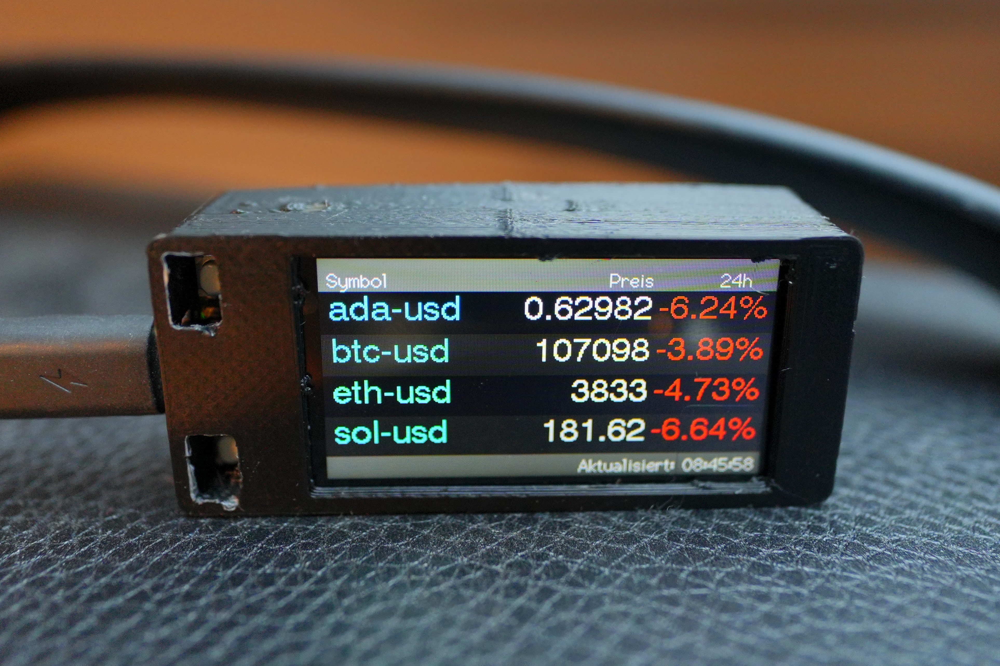

# LilyGo T-Display S3 – Crypto Ticker

A compact ESP32-S3 project for the LilyGo T-Display S3 showing live cryptocurrency prices (via CoinGecko) on the built-in ST7789 TFT display.

I recently started buying some cryptocurrencies and found myself checking my smartphone so often that I thought it would be cool to have a small display to track the market without the distraction of a phone. I had a T-Display lying around, and with the help of AI, the idea became reality just a few hours later.

disclaimer: This project was developed with the assistance of **ChatGPT (OpenAI)**.



---

## ✨ Features

- Real-time price and 24 h change for up to 4 crypto assets
- Data fetched securely from CoinGecko API
- Display rotation by hardware button (cable left/right)
- 5-level brightness control
- Persistent Wi-Fi and asset settings (stored in flash)
- Serial commands for quick setup (Wi-Fi, assets)
- Optional NTP time sync (Europe/Berlin)
- Compatible with ESP32 Core 2.0.17

---

## 🧰 Requirements

### Hardware
- LilyGo T-Display S3
- 1-cell LiPo battery (3.7 V, e.g. 102560 ≈ 1800 mAh, JST-GH 1.25 mm)
- USB-C cable

### Software
- Arduino IDE ≥ 2.2
- ESP32 board package 2.0.17
- Libraries:
  - TFT_eSPI (from official LilyGo repo)
  - ArduinoJson
  - Preferences
  - WiFi, HTTPClient, WiFiClientSecure

> ⚠️ Using the TFT_eSPI version from the Arduino Library Manager will not work – install LilyGo’s official fork instead.

---

## ⚙️ Setup Steps

1. Clone or download this repo
```bash
git clone https://github.com/yourname/TDisplayS3-CryptoTicker.git
```
2. Open the project in Arduino IDE (`StockDisplay.ino`).
3. Select the correct board:
   - Board: ESP32S3 Dev Module
   - USB CDC On Boot: Enabled
   - PSRAM: Enabled
   - Upload Speed: 921600
   - Port: your device’s serial port
4. Select correct TFT configuration in:
   ```
   <Arduino>/libraries/TFT_eSPI/User_Setup_Select.h
   ```
   Uncomment:
   ```cpp
   #include <User_Setups/Setup206_LilyGo_T_Display_S3.h>
   ```

---

## 🚀 Upload & First Start

1. Connect via USB-C
2. Upload sketch
3. Open Serial Monitor (115200 baud)
4. If prompted, enter Wi-Fi SSID and password

Once connected, prices appear automatically.

---

## 🧩 Serial Commands

| Command | Description |
|----------|-------------|
| ASSETS? | Show current asset list |
| SET_ASSETS BTC-USD,ETH-USD,... | Set up to 4 assets (comma-separated) |
| RESET_WIFI | Clear saved Wi-Fi credentials |

---

## 🔆 Buttons

| Button | Function |
|---------|-----------|
| Left (GPIO 0) | Rotate display (cable left/right) |
| Right (GPIO 14) | Change brightness (5 levels) |

Brightness and rotation persist after reboot.

---

## ⏰ NTP Time Sync

Syncs with pool.ntp.org / time.nist.gov (Europe/Berlin).  
If time stays at 0:00:00 → check Wi-Fi connection.

---

## 🔋 Battery

The board has a built-in TP4054 charger for 3.7 V LiPo cells.

Recommended (≤ 26 × 62 mm):

| Model | Capacity | Size (mm) | Notes |
|--------|-----------|-----------|--------|
| 102560 | ~1800 mAh | 10.5 × 25 × 60 | Perfect fit |
| 112560 | ~2000 mAh | 11 × 25 × 60 | Max capacity |
| 602540 | ~600 mAh | 6 × 25 × 40 | Compact option |

Use only 1S (3.7 V nominal) LiPo with JST-GH 1.25 mm 2-pin connector.

---

## 🧠 Common Pitfalls

- “Piano-striped” display edge → wrong rotation (use 1 or 3)
- Offsets ignored → wrong TFT_eSPI library
- HTTP 401 → switch to CoinGecko API
- Brightness not changing → PWM must be set after tft.init()
- Time = 0:00:00 → no NTP sync
- Port greyed out → use ESP32 core 2.0.17

---

## 🧾 License

This project is licensed under the **GNU General Public License v2.0 (GPL-2.0)**.

You are free to use, modify, and share this work under the terms of the GPL-2.0 license.
See the [LICENSE](LICENSE) file for details.

---

**Enjoy your DIY Crypto Ticker!**
